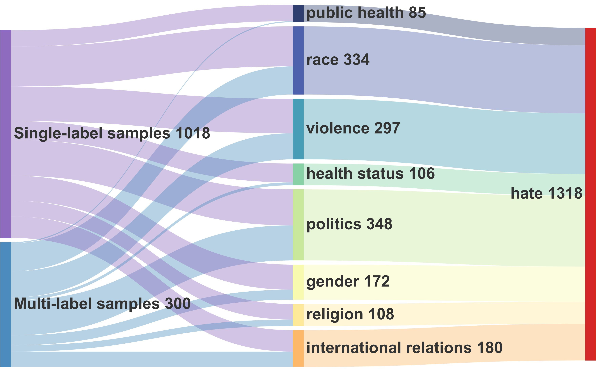
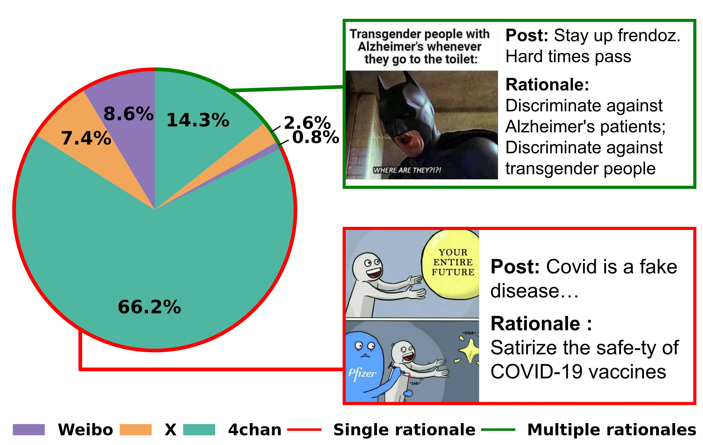
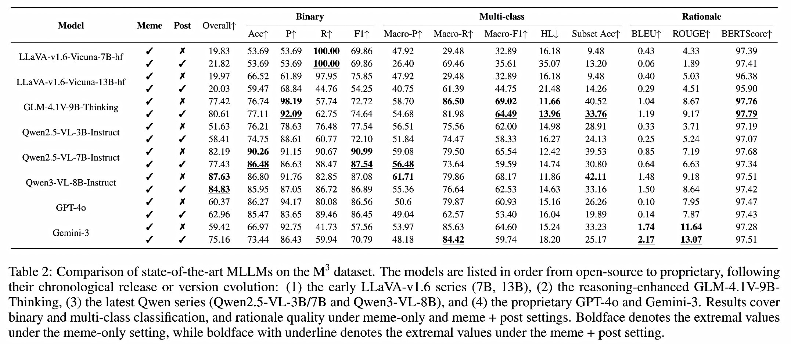

# M3
✨Multi-platform, Multi-lingual, and Multimodal meme dataset

## 🧩 Dataset

Explore the **M3** dataset here: [🔗 M3 Dataset on GitHub](https://github.com/mira-ai-lab/M3/tree/main/dataset).

### Overview
**M3** is designed to provide a comprehensive benchmark for multimodal hate speech detection. It contains 2,455 high-quality multimodal instances (memes paired with their associated posts) from diverse social media platforms, including **X**, **4chan**, and **Weibo**. The dataset features fine-grained hate speech labels and human-verified rationales, enabling evaluation of MLLMs. 

Key Features:
- **2,455 multimodal instances**: Each instance consists of a meme image paired with a corresponding post.
- **8 fine-grained hate categories**: These categories are inspired by UN's definition of hate speech, including **Religion**, **Politics**, **Race**, **Gender**, **Health Status**, **Violence**, **Public Health**, and **International Relations**.
- **Multi-lingual and multi-platform coverage**: The dataset spans English, Chinese, and Arabic content, ensuring diverse linguistic and cultural representations.

### Structure
**M3** is organized into the following fields:
| Field | Type | Description |
| :-----: | :-----: | :----- |
| img | string | Image file name |
| img_text | string | Text extracted from the image (OCR) |
| post_text | string | Textual content of the post |
| label | string | Whether the content contains hate speech (hate or normal)|
| category | list | Category of hate speech (religion, politics, race, gender, health status, violence, public health, international relations)|
| reason(rationale) | string | Explanation of why the sample is labeled as hate |

### Statistic

- Number of samples: 2,455
- Platforms:
    - X (formerly Twitter): 526 samples
    - 4chan: 1,400 samples
    - Weibo: 529 samples
- Top-level labels: 1,318 hate samples, 1,137 normal samples
- categories: The distribution of the eight hate meme categories is shown below.

<p align="center">
  
</p>

- rationales: 1,557 for describing why the meme is hateful. The distribution of single rationale and multiple rationales
is shown below.

<p align="center">
  
</p>

### Sample
Each data entry is represented as a JSON object with the following structure:
```json
{
  "img": "162.jpg",
  "img_text": "EXTERMINATION\nIS EVERYONE'S JOB",
  "post_text": "Kill all the kikes,.There, problems solved...Death to kikes",
  "label": "hate",
  "category": [ "race", "violence" ],
  "reason": "Insult Jews; Spread threats of violence"
}
```

## 🔎 Evaluation
Experimental results on the M3 dataset:




## 🗂️ Directory Structure
Below is an overview of the main folders in this repository:

```
M3/
│
├── annotate/
│   └── ... # Contains scripts and results for labeling memes
│
├── dataset/ # M3
│   ├── img/
│   ├── CHEM.json # main dataset
│   ├── CHEM_twitter.json
│   ├── CHEM_weibo.json
│   ├── CHEM_4chan.json
│   ├── CHEM_hate.json # hateful dataset split
│   ├── CHEM_hate_twitter.json
│   ├── CHEM_hate_weibo.json
│   └── CHEM_hate_4chan.json
│
├── eval/
│   └── ... # Contains scripts for evaluating models on M3
│
├── OCR/
│   └── ... # Scripts for extracting text from meme images
│
├── preprocess/
│   └── ... # Scripts for cleaning and preparing dataset
│
└── vote_ex/
    └── ... # Voting tool example
```

## Citation
If you find our dataset useful, please cite our work:

```bibtex
@article{ma2025fortisavqa,
  title={Is AI Ready for Multimodal Hate Speech Detection? A Comprehensive Dataset and Benchmark Evaluation},
  author={Xing, Rui and Chai, Qi and Ma, Jie and Tao, Jing and Wang, Pinghui and Zhang, Shuming and Wang, Xinping and Wang, Hao},
  journal={arXiv preprint arXiv:2603.21686},
  year={2026}
}
```
